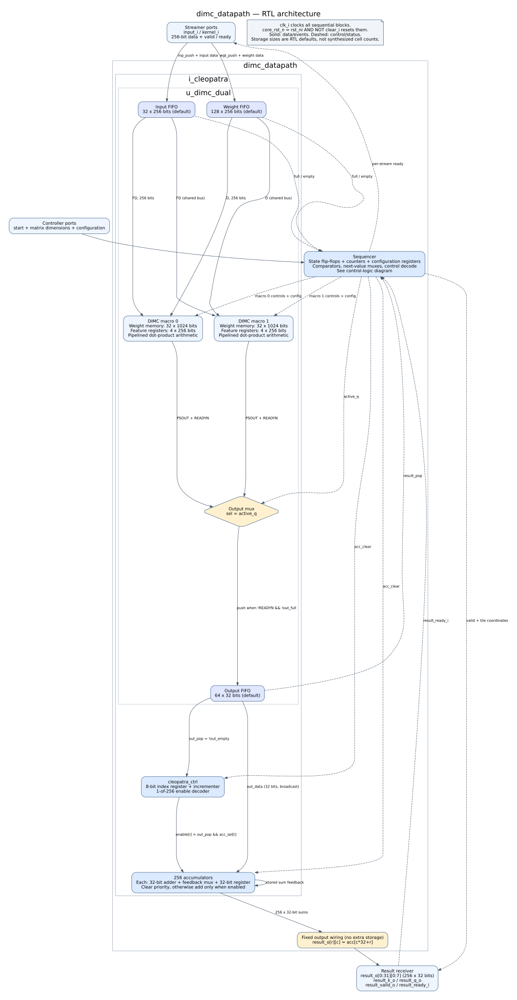
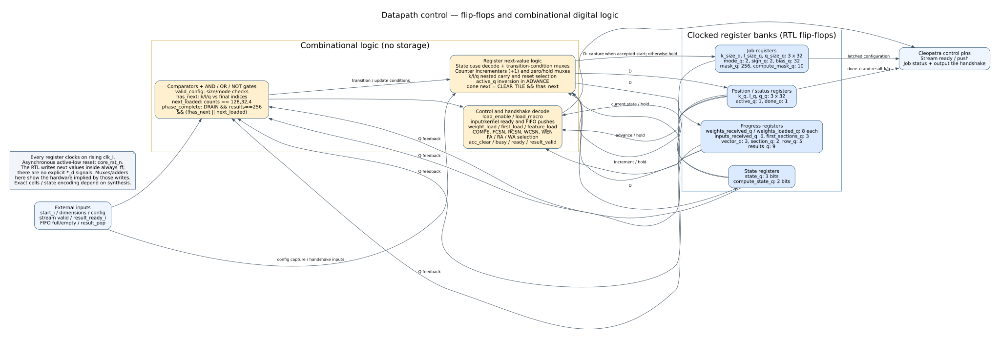
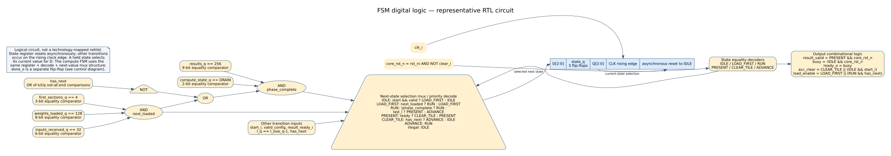
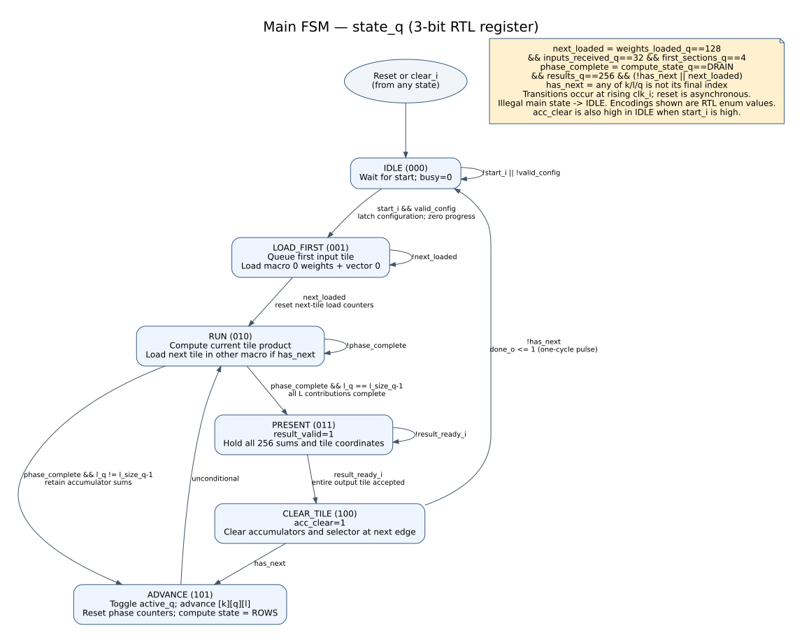
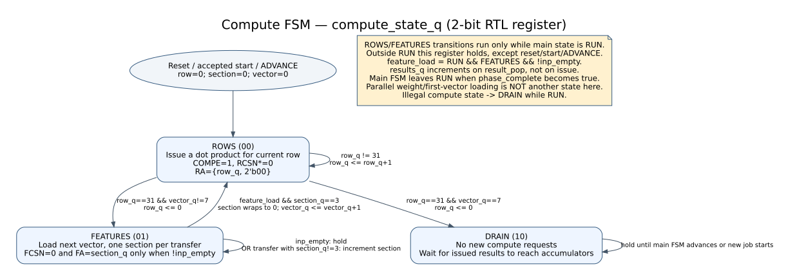

# Datapath architecture and FSM diagrams

These diagrams describe the current `rtl/dimc_datapath.sv` and its Cleopatra
instance. They show RTL registers and combinational hardware, rather than a
synthesized gate-level netlist. Synthesis can change register encoding, merge
logic, or implement storage differently. Default FIFO sizes are shown.

## 1. Overall architecture



The sequencer controls two macros independently. The shared FIFO data buses
reach both macros, but each macro loads only when its own enable is asserted.
`active_q` selects which macro's results enter the output FIFO. It does not
select which macro may load data.

The 256 accumulators are the output tile storage. There is no second result
buffer: the sequencer stops computation in PRESENT and holds the sums until
the receiver accepts them. Controller and streamer boxes represent external
ports; their full-matrix delivery logic is not implemented by this datapath.

## 2. Registers and combinational control



Blue register banks store values across clock cycles. Yellow blocks represent
combinational operations: comparisons, logic gates, addition, and selection.
`D` is a register's next value; `Q` is its current stored value. The feedback
paths let the logic choose whether to hold, increment, clear, or replace Q.
The RTL expresses these choices inside `always_ff`; separate D wires need
not be explicitly declared for this hardware to be inferred.

For example, `weights_received_q` holds when no beat arrives, increments on
`wgt_push`, and resets when a new loading phase begins. Its hardware is an
8-bit register with increment and next-value selection logic.

## 3. FSM digital circuit



This view expands the completion conditions into equality comparators and
AND/OR/NOT operations. The next-state mux uses those conditions and the
decoded current state to choose the three bits captured by `state_q` at the
next rising clock edge. The compute FSM follows the same principle with a
two-bit state register.

`next_loaded` requires the next tile's weights, all input beats, and first
loaded vector. `phase_complete` additionally requires all 256 current results
to have reached the accumulators. On the last tile product, no next load is
required. This prevents switching the output mux before pending results arrive.

## 4. Main FSM



A job is one whole matrix multiplication. A phase is one weight-tile by
input-tile product. The RUN-to-ADVANCE path preserves accumulator sums across
the L phases belonging to one output tile. The RUN-to-PRESENT path exposes
that tile only after the final L contribution.

PRESENT accepts a tile on a rising edge with `result_ready_i` high. During the
following CLEAR_TILE cycle, `acc_clear` is high; the accumulators clear at its
ending edge. If the job is finished, that edge also sets `done_o` for one cycle
and returns the main FSM to IDLE. Otherwise ADVANCE switches to the prepared
macro. The next macro was loaded before entering PRESENT.

## 5. Compute FSM inside RUN



Each input tile contains eight column vectors. ROWS issues 32 row computations
for one vector. FEATURES then loads the next vector in four sections, waiting
if the input FIFO is empty. After the eighth vector, DRAIN stops issuing
commands while results complete. The main FSM decides when the phase ends.

Weight loading and preparation of the other macro's first vector operate in
parallel with this compute FSM. They use counters and enables, not a separate
loader-state register. The other macro consumes feature data only after the
active macro has loaded its last vector, preserving shared-FIFO ordering.

## Formats and regeneration

Each diagram has an editable `.dot` source, a zoomable `.svg`, and a `.png`
in [diagrams](diagrams/). For example, from the repository root:

```bash
dot -Tsvg docs/diagrams/dimc_main_fsm.dot -o docs/diagrams/dimc_main_fsm.svg
dot -Tpng docs/diagrams/dimc_main_fsm.dot -o docs/diagrams/dimc_main_fsm.png
```

For the input/output protocol, see [the interface notes](dimc_datapath.md).
